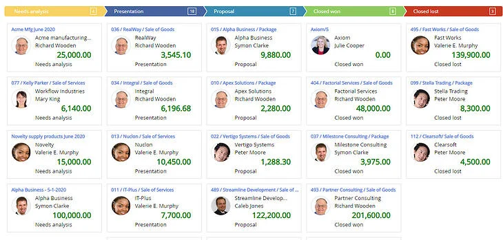

# Create a Static Dashboard
So we have talked a lot about `react`, `state`, and `props`. Now its time to put it into action. In this lab we will be utilizing the concepts learned so far to create a static version of the dashboard mock provided below.

## Instruction
1. Fork and Clone this Repo
2. Change into the directory
3. Build out a clone of the mock that is displayed above

## How to Approach Building This
1. Planning:
   - Break down the mock into components
     - Think about how many components you see in the mock
   - Then think about the data and content each component should contain
     - What tags are needed?
     - What assets might be needed?
     - What content is needed?
   - Think about how you are going to create your data models
     - All data must be store in `App.js`'s state and passed down to it child/children components.
2. Build It
- Build out initial scaffolding for each component you think is needed.
- Then create your initial data sets for each component

## Requirements
1. `App.js` must be the initial entry point for your project, meaning all components must render from there.
2. You must pass all data from your `App.js` component's state to the children components being rendered.
3. You must render at least 5 of the `image cards`
# Submission Instructions
- Create a Pull Request